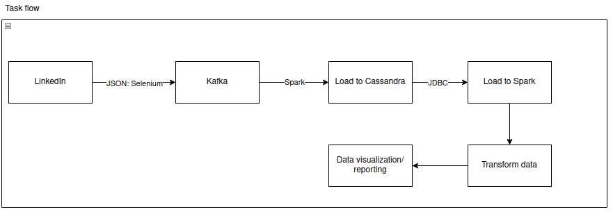
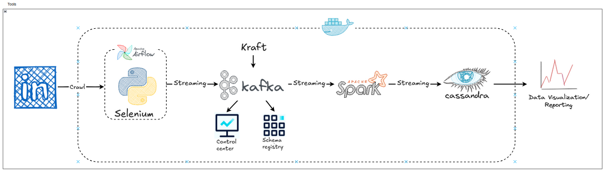

# Introduction

### Research Subject  
The dataset consists of job posting data collected from LinkedIn, focusing on job listings in Ho Chi Minh City with the keyword "Python". The dataset, totaling **31,352 records**, includes details such as job titles, company names, addresses, posting dates, and job links. This data was gathered using web scraping techniques via the Selenium library in Python.

### Research Scope  
This project aims to design and deploy an **ELT (Extract-Load-Transform)** system in a local environment with scalability to process real-time job posting data. The project then analyzes this data to uncover recruitment trends and insights. Key components include:  

- **ELT Process**: Leveraging Selenium for data extraction, Apache Kafka for real-time streaming, Apache Spark for data processing, and Cassandra for storage.  
- **Database Management**: Storing raw data in **Cassandra** for distributed, scalable access.  
- **Data Analysis**: Using Apache Spark and Python (with Matplotlib) to analyze recruitment trends.  
- **Automation System**: Automating the workflow with **Apache Airflow** deployed on **Docker**.  

---

# System Workflow

### 1. Data Extraction (Extract)  
- **Data Source**: Scraping job postings from LinkedIn using Selenium (Python).  
- **Extracted Fields**:  
  - `job_title`: Job title.  
  - `address`: Job location.  
  - `company_name`: Name of the hiring company.  
  - `job_link`: URL of the job posting.  
  - `posted_time`: Date of posting.  
- **Format**: Data extracted in JSON format.

### 2. Data Loading (Load)  
- **Real-Time Streaming**: Data is streamed into **Apache Kafka** topics for continuous processing.  
- **Storage**: Apache Spark creates keyspaces and tables in **Cassandra**, then loads data from Kafka into Cassandra in real-time.  

### 3. Data Transformation (Transform)  
- **Data Cleaning**: Removing NULL values, duplicates, and unnecessary columns (e.g., `job_link`).  
- **Data Enrichment**: Splitting `posted_day` into day, month, and year columns, and reformatting data types for analysis.  
- **Processing**: Performed using Apache Spark via JDBC connection to Cassandra.

### 4. Data Analysis  
- **Tools**: Python for processing and Matplotlib for visualization.  
- **Analysis Questions**:
  1. How many companies are recruiting programmers?  
  2. What are the top 20 recruiting companies?  
  3. Which job field has the most postings?  
  4. How do job postings vary over time (daily, weekly, monthly)?  

### 5. Automation with Apache Airflow  
The ELT workflow is automated using Directed Acyclic Graphs (DAGs) in Apache Airflow, ensuring systematic data collection, streaming, and loading from LinkedIn.  

---

# Job Posting Data Analysis  
Data analysis is conducted using **Python** and **Apache Spark** for processing, with **Matplotlib** for visualization, to address the following questions:  

1. **How many companies are recruiting programmers?**  
   - Counts unique companies in the dataset.  
2. **What are the top 20 recruiting companies?**  
   - Identifies companies like OPSWAT, Shopee, and Galaxy FinX as top recruiters.  
3. **Which job field has the most postings?**  
   - Highlights "Data" (11,024 postings), "Software Development" (8,004), and "AI" (4,877) as leading fields.  
4. **How do job postings vary over time?**  
   - Analyzes trends by day (peaks on days 17, 18, 25) and month (peak in March, decline in July-October).  

**Details**: See [Data Analysis Notebook](DA/DA.ipynb).

---

# Project Setup and Execution  

To run the project, follow these steps:  
1. **Install Docker**: Follow the instructions at [Docker Installation](https://docs.docker.com/engine/install/).  
2. **Set up Apache Airflow**: Refer to [Airflow Docker Setup](https://airflow.apache.org/docs/apache-airflow/stable/howto/docker-compose/index.html).  
3. **Install Dependencies**:  
   - Ensure **Java JDK 8+**, **Python 3.6+**, and required libraries (Selenium, Matplotlib) are installed.  
   - Configure Kafka, Spark, and Cassandra as per the report.  
4. **Navigate to Project Directory**: Open a terminal in the `Project_Kafka` folder.  
5. **Run Docker Compose**: Execute `docker-compose up` to start Airflow, Kafka, Spark, and Cassandra containers.  
6. **Access Services**:  
   - Airflow UI: [**localhost:8080**](http://localhost:8080) (user: admin, password: admin).  
   - Kafka: `localhost:9092`.  
   - Spark: `localhost:9090`.  
   - Cassandra: `localhost:9042`.  
7. **Execute the ELT Workflow**: Trigger the Airflow DAGs to start the extraction, loading, and transformation process.  
8. **Run Data Analysis**: Execute the analysis script/notebook at [DataAnalysis.ipynb](DA/DA.ipynb).

---

# Conclusion  
This project demonstrates the power of Apache Kafka in building a scalable, real-time data processing system. By integrating Kafka with Spark, Cassandra, and Airflow, the system efficiently handles job posting data from LinkedIn, providing valuable insights into recruitment trends in Ho Chi Minh City. Future enhancements could include ETL integration with a Data Warehouse and advanced analytics with machine learning.
